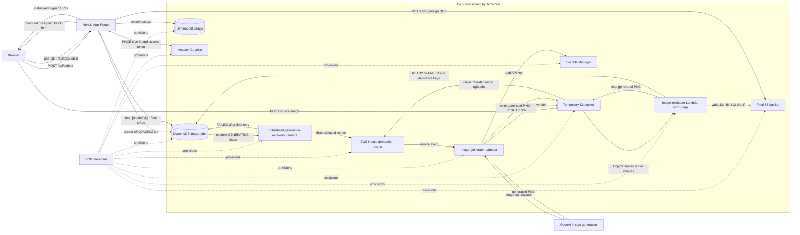

# Happy Holiday Icon 

Happy Holiday Icon turns an uploaded PNG, JPEG, or WebP image into a holiday vibed icon, then produces optimized WebP derivatives at 32px, 48px, and 512px. 

## Run

```
git clone https://github.com/pwang1997/happy-holiday-icon.git
cd happy-holiday-icon
pnpm install
pnpm run dev
```
The command starts the Web UI, served at http://127.0.0.1:3000 by default.

## Architecture



## API contract

[`openapi.yaml`](openapi.yaml) documents the six App Router endpoints for **job admission**, **polling**, and **Cognito auth**. It includes request schemas, response states, error cases, optional bearer or cookie authentication, and the bounded presigned S3 POST upload handoff.

## Provision infrastructure

The Terraform module is in [`infra/`](infra/README.md). It is configured to use the HCP Terraform organization, project, and `dev` workspace declared in `infra/versions.tf`.

```sh
./infra/lambda/build.sh
terraform -chdir=infra init
terraform -chdir=infra validate
terraform -chdir=infra plan
terraform -chdir=infra apply
```

Configure the Next.js runtime from the `app_environment` Terraform output. Attach `image_upload_policy_arn`, `image_jobs_policy_arn`, and `anonymous_usage_policy_arn` to its runtime identity. Terraform configures the Lambda execution role, S3 notification, and Lambda access automatically.
