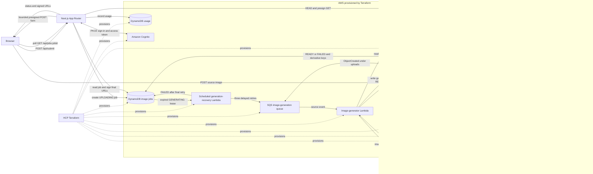

# Happy Holiday Icon 

<p>
  <a href="https://nextjs.org/"></a>
  <a href="https://www.langchain.com/"></a>
  <a href="https://www.terraform.io/"></a>
  <a href="https://aws.amazon.com/"></a>
  <a href="https://github.com/pwang1997/happy-holiday-icon/actions/workflows/ci.yml"></a>
</p>

Happy Holiday Icon turns an uploaded PNG, JPEG, or WebP image into a holiday vibed icon, then produces optimized WebP derivatives at 32px, 48px, and 512px. 

## Run

```
git clone https://github.com/pwang1997/happy-holiday-icon.git
cd happy-holiday-icon
pnpm install
pnpm run dev
```
The command starts the Web UI, served at http://127.0.0.1:3000 by default.

## Architecture



## API contract

[`openapi.yaml`](openapi.yaml) documents the six App Router endpoints for **job admission**, **polling**, and **Cognito auth**. Before OpenAI prompt validation, `POST /api/submit` validates the request, authenticates the caller, and atomically enforces per-caller rate and concurrency limits. It then rejects attempts to override the image-generation instructions, creates the job, records usage, and returns the bounded presigned S3 POST upload handoff.

## Provision infrastructure

The Terraform module is in [`infra/`](infra/README.md). It is configured to use the HCP Terraform organization, project, and `dev` workspace declared in `infra/versions.tf`.

```sh
./infra/lambda/build.sh
terraform -chdir=infra init
terraform -chdir=infra validate
terraform -chdir=infra plan
terraform -chdir=infra apply
```

Configure the Next.js runtime from the `app_environment` Terraform output. Attach `image_upload_policy_arn`, `image_jobs_policy_arn`, `anonymous_usage_policy_arn`, and `submission_guard_policy_arn` to its runtime identity. Set the private `SUBMISSION_GUARD_SECRET` separately. Anonymous submissions require the trusted proxy to remove any client-supplied `X-Submission-Proxy-Token`, inject the configured secret, and supply a sanitized `X-Forwarded-For` header. Terraform configures the Lambda execution role, S3 notification, and Lambda access automatically.

## Test coverage

`pnpm test:coverage` prints Node's line, branch, and function coverage summary. GitHub Actions saves the raw V8 profiles in `coverage/` and uploads them as the `test-coverage` artifact.
